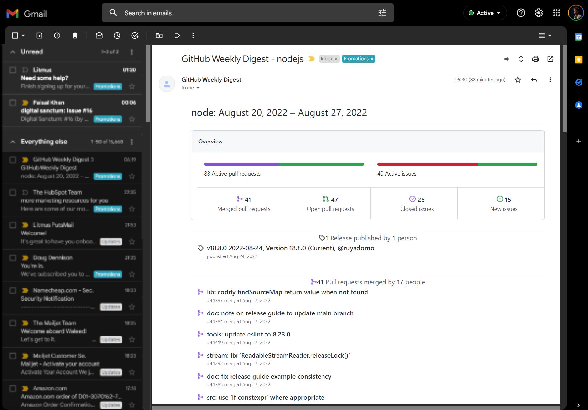

# GitHub Weekly Digest

Receive weekly digest of GitHub repo updates. You can subscribe to multiple repos in one email. You'll receive 1 email for each entry you add in [subscribers.csv](subscribers.csv) file. You can add multiple entries with different email address.

## How it works:
1. Open a pull request, and add your entry in [subscribers.csv](subscribers.csv) file.
2. Follow the given format,

\<YOUR EMAIL\>,\<ORG Name OR USER Name>,\<Name of repositories>

3. In one entry, you can add multiple repos of the same user/org.
4. Email will be sent every Monday at 0800 UTC.
5. You'll receive email from no_reply@waleedashraf.me. Add it to safe sender to avoid spam.
6. All repositories you add must be public.

## Preview

